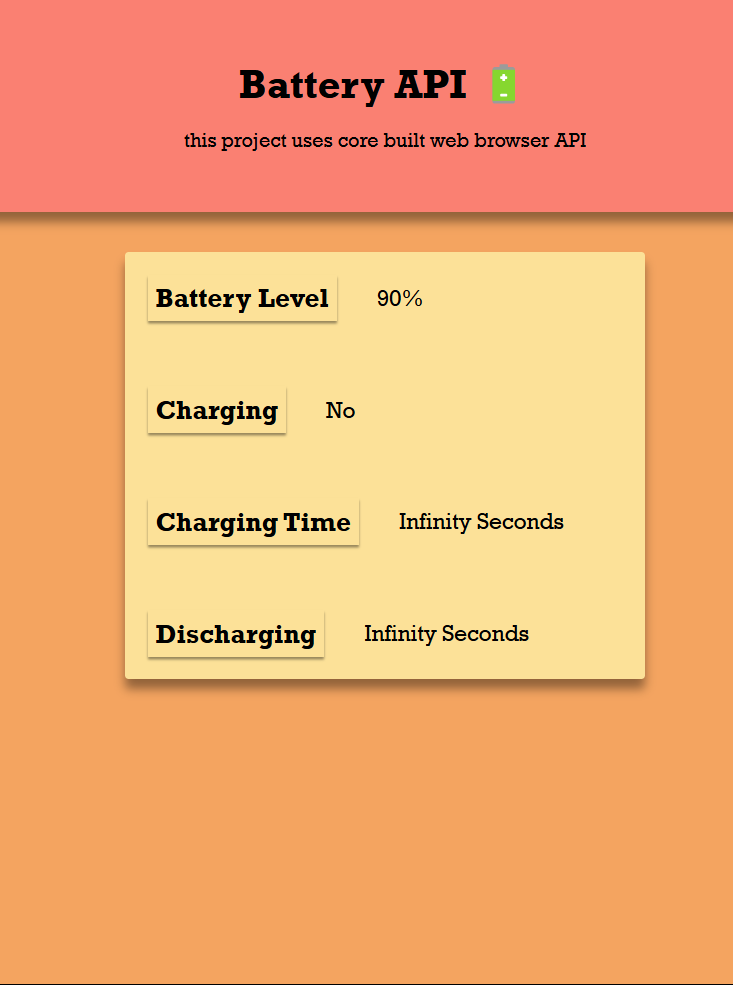

# Battery API

**BatteryAPI**: A JavaScript library for monitoring and managing battery status in web applications. This API provides real-time insights into battery levels, charging status, and system energy consumption. It's designed to enhance user experience by optimizing performance and power usage in battery-dependent devices.

## Appendix

Project Overview: A JavaScript library for monitoring and managing battery status in web applications. This API provides real-time insights into battery levels, charging status, and system energy consumption. It's designed to enhance user experience by optimizing performance and power usage in battery-dependent devices.

Technical Details: To enhance the project BatteryAPI, HTML, CSS and JavaScript is used.

Optimize Performance: Efficient use of the Battery API to avoid unnecessary battery drain.

Responsive Design: Use media queries in CSS to create a responsive design that adapts to different screen sizes and orientations.

User Experience: Improving user interaction with JavaScript.

Code Quality: Better readability and maintainability. Used comments and consistent naming conventions.

## Authors

- [@Ravi Panchal](https://github.com/saneinfringer)

## Color Reference

| Color             | Hex                                                                |
| ----------------- | ------------------------------------------------------------------ |
| Example Color |  #fa8072 |
| Example Color |  #f4a460 |

## Demo

https://saneinfringer.github.io/BatteryAPI/

## Features

- Battery Level
- Battery charging
- Battery Charging Time
- Battery Discharging Time

## Lessons Learned

Event Listening Optimization:
Debouncing or throttling event listeners can significantly reduce unnecessary function calls and improve performance when handling frequent battery level changes.
Removing event listeners when no longer needed conserves resources, especially for applications that only require battery information temporarily.
Data Structure Selection:
Utilizing efficient data structures like arrays or typed arrays (e.g., Float32Array) is crucial for storing and retrieving battery data (e.g., historical level information) with speed and memory optimization.
Power-Saving UI Practices:
Minimizing DOM manipulations and employing techniques like requestAnimationFrame or virtual DOM libraries (e.g., React, Vue) help minimize browser reflows and enhance UI rendering efficiency.
Exploring lighter UI representations, such as CSS animations or SVGs, can further reduce rendering overhead compared to complex HTML elements.
Browser-Specific Optimization:
For Android apps, leveraging the WorkManager API can ensure efficient scheduling of asynchronous tasks related to battery data, potentially improving battery life.
Testing and Profiling:
Thorough testing under various battery levels (full charge, critically low) is essential to identify and address potential performance issues or unexpected behavior.
Utilizing browser developer tools for profiling helps pinpoint performance bottlenecks in your code, allowing you to focus optimization efforts on the most impactful areas.

## Optimizations

User Experience:

Intuitive Interface: Design a clean and user-friendly interface with easy-to-understand controls. Consider user testing to identify and address any usability issues.

## Screenshots

## License

[MIT](https://choosealicense.com/licenses/mit/)

## Feedback

If you have any feedback, please reach out to us at xiansfactor@gmail.com

## Support

For support, email xiansfactor@.com or join on instagram @v8_m5_cs.

